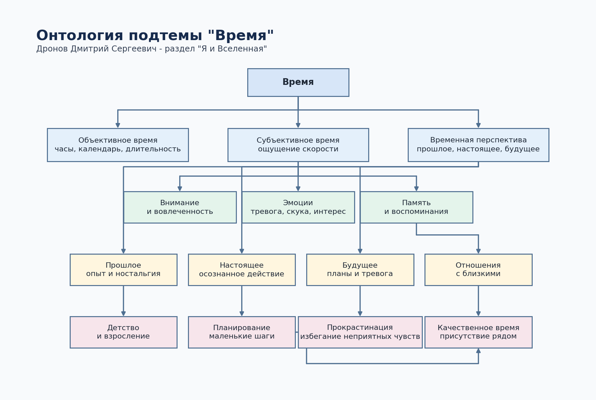

# Время

Раздел: **Я и Вселенная**. Подтема: **Время**.

## 1. Кто работал над темой

Дронов Дмитрий Сергеевич

## 2. О чём эта тема

Подтема раскрывает время не только как физическую величину, но и как личный опыт подростка: почему минуты иногда тянутся, почему детство кажется длинным, как не застревать в прошлом или будущем, как планировать дела и почему время с близкими нельзя бесконечно откладывать.

Ключевые слова: время, прошлое, настоящее, будущее, память, внимание, планирование, прокрастинация, отношения.

## 3. Какие статьи входят в тему

- `why-time-flies-or-drags.md` — Почему время летит или тянется
- `childhood-ends-what-am-i-losing.md` — Детство кончается — что я теряю
- `living-in-the-past-future-or-present.md` — Жить прошлым, будущим или настоящим
- `how-not-to-waste-time.md` — Как не тратить время впустую
- `time-and-relationships-with-loved-ones.md` — Время и отношения с близкими

## 4. Схема связей внутри темы

Текстовое описание:

- **объективное время** → **субъективное время** (отличается от)
- **внимание** → **субъективное время** (изменяет ощущение)
- **память** → **прошлое** (сохраняет)
- **прошлое** → **детство** (содержит опыт)
- **будущее** → **планирование** (требует)
- **прокрастинация** → **планирование** (мешает)
- **настоящее** → **качественное время** (позволяет проживать)
- **качественное время** → **отношения с близкими** (укрепляет)
- **память** → **отношения с близкими** (создаёт общую историю)

## 5. Как эта тема связана с другими темами раздела

- Связана со **смыслом жизни**, потому что ощущение осмысленности зависит от того, как человек видит прошлое, настоящее и будущее.
- Связана со **счастьем**, потому что счастье часто переживается как короткий, но насыщенный момент.
- Связана со **смертью и страхами**, потому что конечность времени заставляет задумываться о ценностях и близких.
- Связана с темой **космоса**, потому что физическое время и масштаб Вселенной дают научный контекст.

## 6. Примеры SPARQL-запросов

Файл с запросами: `scripts/sparql_query.py`

В нём есть:

- `QUERY_SEED_ENTITIES` — базовые сущности Wikidata по теме времени;
- `QUERY_EXPAND_CLASS_TREE` — расширение через `instance of` / `subclass of`;
- `QUERY_LOCAL_GRAPH` — прямые связи от выбранных сущностей;
- `QUERY_REVERSE_GRAPH` — обратные связи к выбранным сущностям.

Итог запуска сохранён в `data/wikidata_export.json`. Все 4 запроса выполнены успешно:

- `seed_entities` — 11 строк;
- `expand_class_tree` — 150 строк;
- `local_graph` — 180 строк;
- `reverse_graph` — 200 строк.

## 7. Где лежат рабочие материалы

- `concepts.json` — финализированный список статей, понятий, связей, seed-сущностей и SPARQL-фокуса;
- `concepts.jsonc` — простой совместимый список названий статей и путей;
- `images/ontology.png` — визуальная схема темы;
- `images/ontology.mmd` — исходник схемы в Mermaid;
- `scripts/sparql_query.py` — набор SPARQL-запросов;
- `data/wikidata_export.json` — лог запуска запросов Wikidata;
- `data/wikidata/*.raw.json` — сырые ответы Wikidata Query Service;
- `data/wikidata/*.normalized.json` — нормализованные результаты запросов;
- `data/llm_generation/*.messages.json` — промпты и контекст генерации;
- `data/llm_generation/*.api_payload.json` — сохранённые payload-структуры для генерации;
- `data/llm_generation/*.generated.md` — сгенерированные версии статей.

## 8. Процесс работы

1. Выделил пять статей внутри подтемы "Время".
2. Сформировал список базовых понятий: объективное время, субъективное время, прошлое, настоящее, будущее, память, планирование, прокрастинация, детство, отношения.
3. Подготовил SPARQL-запросы к Wikidata и сохранил raw/normalized результаты.
4. Построил граф понятий и визуальную онтологию.
5. Сгенерировал и вычитал статьи для `WEB/Me_and_the_universe/Time/concepts/`.
6. Добавил внутренние ссылки, полезные Wikidata-понятия и навигацию.
7. Сохранил артефакты генерации в `data/llm_generation/`.

## 9. Личные ощущения от работы

Эта тема оказалась шире, чем просто разговор о расписании или тайм-менеджменте. Время связано с памятью, взрослением, тревогой о будущем и отношениями с близкими. Поэтому в статьях сделан акцент не на том, как "успевать всё", а на том, как понимать, куда уходит жизнь и какие моменты действительно хочется сохранить.

Особенно полезной оказалась связь между субъективным временем и памятью: день может быть коротким по часам, но длинным по впечатлениям. Это хорошо подходит для подростковой энциклопедии, потому что объясняет знакомое ощущение простыми словами.
