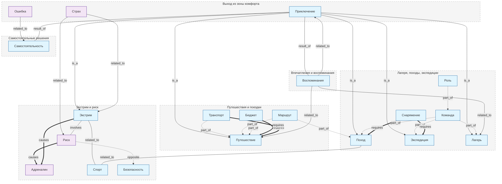

# Раздел 10: Я И МОИ ПРИКЛЮЧЕНИЯ

Автор: Саяпин Егор Дмитриевич М8О-103СВ-25
## Обзор

Раздел посвящён активному отдыху, путешествиям, походам, лагерям,
экстремальным увлечениям и всему, что связано с выходом за пределы
повседневности. Онтология описывает 20 ключевых понятий и связи между ними.

## Структура

Раздел состоит из **6 тематических блоков**, каждый из которых содержит
статьи (ответы на вопросы) и глоссарий понятий (`concepts/`).

| Блок | Статьи | Понятия |
|------|--------|---------|
| Выход из зоны комфорта | 4 | Приключение, Страх, Ошибка |
| Путешествия и поездки | 4 | Путешествие, Транспорт, Маршрут, Бюджет |
| Лагеря, походы, экспедиции | 4 | Поход, Экспедиция, Лагерь, Команда, Роль, Снаряжение |
| Экстрим и риск | 4 | Экстрим, Риск, Адреналин, Спорт, Безопасность |
| Самостоятельные решения | 4 | Самостоятельность |
| Впечатления и воспоминания | 4 | Воспоминания |

## Типы связей между понятиями

| Тип связи | Описание | Пример |
|-----------|----------|--------|
| `is_a` | Иерархия | Экстрим есть разновидность Приключения |
| `part_of` | Часть целого | Маршрут — часть Путешествия |
| `requires` | Обязательное условие | Походу нужно Снаряжение |
| `involves` | Включает в себя | Экстрим включает Риск |
| `causes` | Причинно-следственная | Риск вызывает Адреналин |
| `opposite` | Противоположность | Риск противоположен Безопасности |
| `related_to` | Смысловая связь | Спорт связан с Экстримом |
| `result_of` | Результат | Приключения ведут к Самостоятельности |

## Диаграмма онтологии

Онтология построена на основе 24 подтем раздела «Я и мои приключения»
(см. `task.md`). Каждое понятие имеет связи с другими понятиями как
внутри своего блока, так и с понятиями из других блоков.
